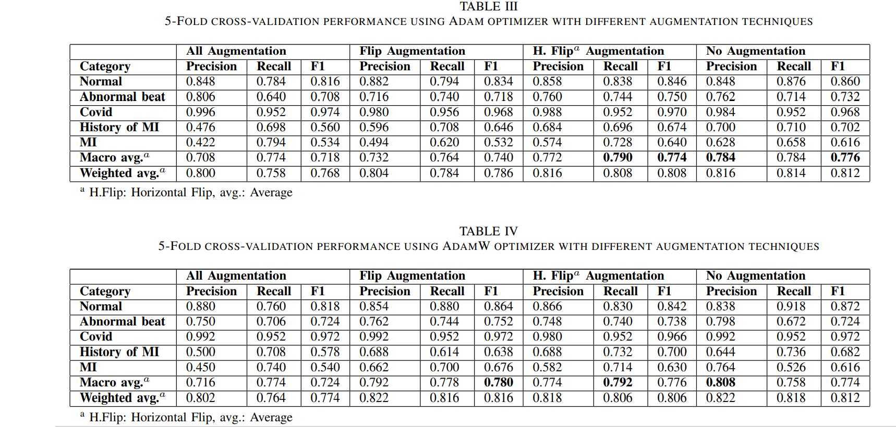

# COVID_Cardiac_diseases_diagnosis
# Title
Effect of Image Augmentation on ECG Image Classification using Deep Learning

# Abstract
The advent of artificial intelligence has led to a better investigation of many complex research problems from a variety of domains. Recently deep learning approaches have emerged as cutting edge AI technologies and has been proved very effective in medical research. A large number of studies have recently used deep learning in the field of medical imaging for the detection and identification of various diseases including COVID-19. In this work, we have investigated an ECG based approach for detection of COVID-19 and heart diseases using deep learning. Deep learning requires a lot of data and image augmentation is a way to enhance the size of data. In this study, we specifically examined the impact of augmenting ECG images for disease detection. Our study indicates that augmentation improves the detection accuracy to a certain extent and can adversely impact beyond that. Without augmentation, we achieved accuracy and F1 score of 0.818 and 0.776 which is reduced to 0.764 and 0.768 respectively, when multiple augmentation techniques are applied. 

# Result



# Citation
```
@INPROCEEDINGS{9445258,
  author={Anwar, Talha and Zakir, Seemab},
  booktitle={2021 International Conference on Artificial Intelligence (ICAI)}, 
  title={Effect of Image Augmentation on ECG Image Classification using Deep Learning}, 
  year={2021},
  volume={},
  number={},
  pages={182-186},
  doi={10.1109/ICAI52203.2021.9445258}}
```
